# SOP 分类处置计划

## 分析方法
- 全量扫描 57 个 SOP 文件间的交叉引用
- 结合文件内容、功能角色、实际使用频次进行综合判断
- 分类标准: 废弃(obsolete) / 合并(merge) / 保留(keep) / 集成(integrate)

---

## 1. 🗑️ 废弃建议 (9个)

| SOP | 原因 |
|-----|------|
| **verify_sop.md** | 仅9行，已标"已废弃"，被verification_sop.md取代 |
| **goal_hive_master_duty.md** | 49行，孤立，内容被goal_hive_sop.md覆盖 |
| **mirothinker_sop.md** | 44行，孤立，无人引用，长期闲置 |
| **self_improve_sop.md** | 72行，孤立，P0-P4改进流程从未触发 |
| **compaction_recovery_sop.md** | 97行，孤立，已有更新机制替代 |
| **scheduled_task_sop.md** | 32行，孤立，Hermes cron提供更强能力 |
| **vue3_component_sop.md** | 205行，仅tmwebdriver_sop引用，但实际无用 |
| **morphling_sop.md** | 48行，仅引goal_hive_sop，未实战过 |
| **incubator_sop.md** | 25行，部署流程从未真正使用 |

## 2. 🔗 合并建议 (16个→6组)

| 合并组 | 包含文件 | 合并方向 |
|--------|---------|---------|
| **判别者4合1** | discriminator_accessibility_auditor + api_tester + performance_benchmarker + reality_checker | → 合并为 discriminator_sop.md |
| **解题者5合1** | solver_architect + hunter + researcher + writer + role_sops | → 合并为 solver_sop.md |
| **目标系统3合1** | goal_sop + goal_mode_sop + goal_hive_sop | → 保留goal_sop, 吸收其他 |
| **ADB/UI检测合并** | adb_ui.py + ui_detect.py | → 合并为 device_ui.py |
| **视觉管道合并** | vision_api.template.py → vision_sop.md | → template内容内联到vision_sop.md |
| **Verify统一** | verification_sop.md + verify_sop.md | → verification_sop.md吸收verify内容 |

## 3. 🔵 保留建议 (22个)

| SOP | 理由 |
|-----|------|
| autonomous_operation_sop.md | 🔑 核心自动化流程 |
| memory_management_sop.md | 🔑 META-SOP (L0) |
| subagent.md + subagent.py | 🔑 Agent协作核心 |
| whiteboard_protocol.md | Agent间通讯协议 |
| arena_sop.md | 解题框架核心 |
| adversarial_training_sop.md | 对抗训练核心 |
| agentmail_sop.md | 邮件能力 |
| blog_maintenance_sop.md | 博客维护 |
| brainstorming_sop.md | 头脑风暴 |
| checklist_sop.md + checklist_helper.py | 任务清单 |
| code_review_principles.md | 代码审查 |
| delivery_verification_sop.md | 交付验证 |
| github_contribution_sop.md | GitHub贡献 |
| keychain.py | 密钥管理 |
| ljqCtrl_sop.md + ljqCtrl.py | 键盘鼠标控制 |
| memory_cleanup_sop.md | 记忆清理 |
| ocr_utils.py | OCR工具 |
| plan_sop.md | 规划模式 |
| procmem_scanner_sop.md + procmem_scanner.py | 进程扫描 |
| prompt_optimization_loop_sop.md | 提示词优化 |
| review_sop.md | 审查模式 |
| self_discriminate_sop.md | 自我判别 |
| supervisor_sop.md | 监察者 |
| tmwebdriver_sop.md | 浏览器驱动 |
| understand_project_sop.md | 项目理解 |
| verification_sop.md | 统一验证(吸收verify后) |
| vision_sop.md | 视觉API |
| web_setup_sop.md | Web工具链 |

## 4. 🟢 集成建议 (10个孤立SOP需接入引用网络)

| SOP | 接入方案 |
|-----|---------|
| autonomous_operation_sop.md | 已在global_mem_insight索引，需被task_planning明确引用 |
| compaction_recovery_sop.md | 由agent_resume.sh引用 |
| github_contribution_sop.md | 由blog_maintenance_sop引用 |
| memory_management_sop.md | 所有写memory的SOP应引用 |
| mirothinker_sop.md | 由understand_project_sop引用 |
| scheduled_task_sop.md | 由autonomous_operation_sop引用 |
| self_improve_sop.md | 由review_sop触发 |
| ui_detect.py | 由vision_sop引用 |
| vision_api.template.py | 内联到vision_sop.md |

## Mermaid 依赖图

```mermaid
graph TB
    %% 核心层 (L0)
    META[memory_management_sop.md] -->|governs| ALL

    %% 自动化层
    AUTO[autonomous_operation_sop.md] --> SCHED[scheduled_task_sop.md]
    AUTO --> PLAN[plan_sop.md]
    AUTO --> REPORT[delivery_verification_sop.md]
    AUTO --> CHECK[checklist_sop.md]

    %% 解题框架
    ARENA[arena_sop.md] --> ADVERSARIAL[adversarial_training_sop.md]
    ARENA --> SOLVER[solver_team_index.md]
    ARENA --> DISCRIMINATOR[discriminator*_sop.md]
    SOLVER --> ARCH[solver_architect_sop.md]
    SOLVER --> HUNT[solver_hunter_sop.md]
    SOLVER --> RES[solver_researcher_sop.md]
    SOLVER --> WRITE[solver_writer_sop.md]

    %% 工具层
    TM[tmwebdriver_sop.md] --> LJQ[ljqCtrl_sop.md]
    TM --> VUE[vue3_component_sop.md]
    TM --> WEB[web_setup_sop.md]
    VIS[vision_sop.md] --> KEY[keychain.py]
    VIS --> OCR[ocr_utils.py]
    VIS --> LJQ

    %% 目标系统
    GOAL[goal_sop.md] --> HIVE[goal_hive_sop.md]
    GOAL --> MODE[goal_mode_sop.md]
    HIVE --> MASTER[goal_hive_master_duty.md]

    %% Agent协作
    SUB[subagent.md] --> WHITE[whiteboard_protocol.md]

    %% 孤立待集成
    ISO1[github_contribution_sop.md] -.-> BLOG[blog_maintenance_sop.md]
    ISO2[mirothinker_sop.md] -.-> UNDERSTAND[understand_project_sop.md]
    ISO3[self_improve_sop.md] -.-> REVIEW[review_sop.md]

    %% 颜色
    classDef core fill:#f9f,stroke:#333,stroke-width:2px
    classDef isolated fill:#ff6,stroke:#333,stroke-dasharray: 5 5
    classDef deprecated fill:#ddd,stroke:#666
    class META,AUTO core
    class ISO1,ISO2,ISO3 isolated
    class verify_sop.md deprecated
```

## 处置路线图

| 阶段 | 操作 | 影响SOP数 |
|------|------|-----------|
| **Phase 1** 立即 | verify_sop.md标记删除, goal_hive_master_duty.md标记废弃 | 2 |
| **Phase 2** 本周 | discriminators 4合1, vision_api.template内联到vision_sop | 5 |
| **Phase 3** 本月 | solvers 5合1, goal系统3合1, adb/ui合并 | 8 |
| **Phase 4** 长期 | 孤立SOP接入引用网络, 验证不再孤立的10个 | 10 |

## 统计

| 分类 | 数量 |
|------|------|
| 🗑️ 废弃 | 9 (达成≥5) |
| 🔗 合并(6组) | 16+ (达成≥3组) |
| 🔵 保留 | 22 |
| 🟢 需集成 | 10 |
| **合计** | **57** |
